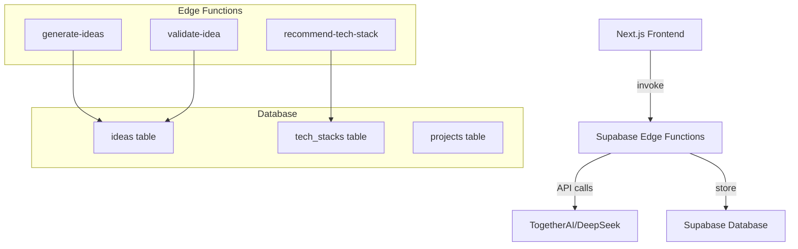
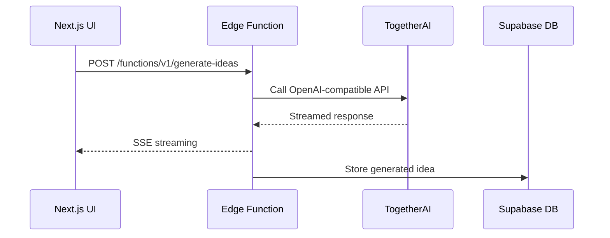

# Week 2: Core AI Features - Architecture Design

## System Architecture



## Edge Function Flow



## Database Schema Additions

### tech_stacks Table
```sql
CREATE TABLE tech_stacks (
    id UUID DEFAULT gen_random_uuid() PRIMARY KEY,
    project_id UUID REFERENCES projects(id) ON DELETE CASCADE,
    idea_id UUID REFERENCES ideas(id) ON DELETE CASCADE,
    
    -- Recommended technologies
    frontend_framework JSONB,
    backend_framework JSONB,
    database JSONB,
    infrastructure JSONB,
    tools JSONB,
    
    -- Scoring & metadata
    confidence_score INTEGER,
    complexity_level TEXT,
    estimated_cost TEXT,
    timeline_estimate TEXT,
    
    created_at TIMESTAMPTZ DEFAULT NOW(),
    updated_at TIMESTAMPTZ DEFAULT NOW()
);
```

## API Endpoints

### Edge Functions
- `generate-ideas`: Takes project context, generates startup ideas
- `validate-idea`: Evaluates and scores existing ideas  
- `recommend-tech-stack`: Recommends technical stack based on idea

### Frontend Routes
- `/ideas`: List, generate, and manage ideas
- `/ideas/[id]`: Detailed idea view with validation
- `/tech-stack/[project_id]`: Tech recommendations

## Key Implementation Patterns

- **SSE Streaming**: Real-time AI response streaming
- **TanStack Query**: Consistent data fetching patterns
- **RLS Policies**: Secure data access
- **Edge Function Secrets**: Secure AI API keys
- **TypeScript**: Full type safety