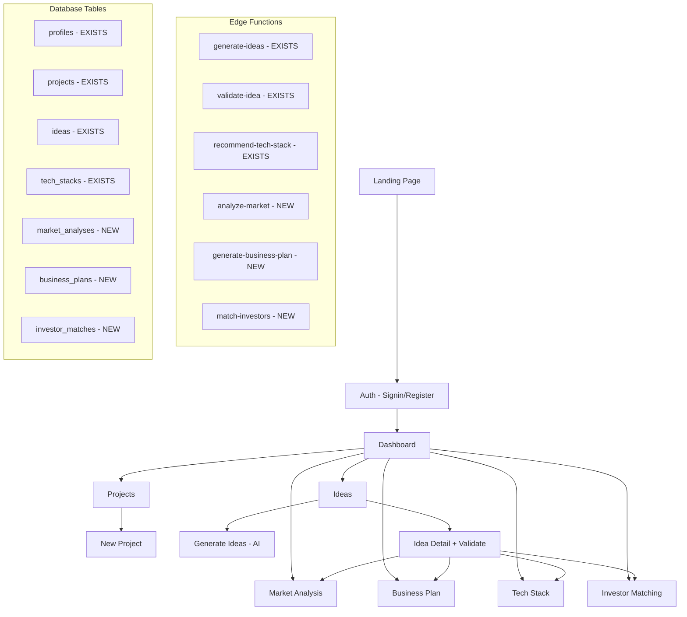

# Week 3: Full Feature Completion - Architecture Plan

## Current State Summary

### What Exists
- **Monorepo**: Turborepo + pnpm + Next.js 16 + Supabase
- **Auth**: Magic link + OAuth via Supabase Auth
- **Database**: profiles, projects, ideas, tech_stacks tables with RLS
- **Edge Functions**: generate-ideas, validate-idea, recommend-tech-stack (all TogetherAI)
- **Frontend**: Dashboard (static), Projects (CRUD), Ideas (mock data), Auth pages
- **Hooks**: use-projects (working), use-ideas (has AI hook but UI uses mock), use-tech-stack (mock)

### What's Missing or Broken
1. Ideas page uses hardcoded mock data instead of calling Edge Function
2. No idea detail page (`/ideas/[id]`)
3. Landing page is default Turborepo template
4. No Market Analysis feature at all
5. No Business Plan Generator feature at all  
6. Tech Stack Recommender has backend but no UI page
7. No Investor Matching feature at all
8. Dashboard shows static cards with no real data
9. Sidebar only has 4 items, missing new feature routes
10. No toast/notification system for async operations

---

## Week 3 Architecture



---

## Phase 1: Fix Foundation

### 1A. Replace Landing Page
Replace the default Turborepo page at `apps/web/app/page.tsx` with a proper Startup Builder landing page that routes to `/signin` or `/dashboard`.

### 1B. Wire Ideas Page to Real AI
Update `apps/web/app/(dashboard)/ideas/page.tsx` to:
- Use the `useIdeas` hook's `generateIdeas` mutation instead of hardcoded mock data
- Require a project context (selected project or project_id param)
- Show loading/streaming states during AI generation
- Save generated ideas to Supabase via the hook

### 1C. Create Idea Detail Page
New route: `apps/web/app/(dashboard)/ideas/[id]/page.tsx`
- Display full idea details (all fields from ideas table)
- Validate button that calls `validateIdea` mutation
- Show validation results (score, strengths, weaknesses, recommendations)
- Action buttons to navigate to Market Analysis, Tech Stack, Business Plan for this idea
- Status badge (draft, in_progress, validated, rejected)

---

## Phase 2: Market Analysis Feature

### Database Migration
```sql
-- New file: supabase/migrations/20260313000006_market_analyses.sql
CREATE TABLE public.market_analyses (
    id UUID DEFAULT gen_random_uuid() PRIMARY KEY,
    idea_id UUID REFERENCES public.ideas(id) ON DELETE CASCADE NOT NULL,
    project_id UUID REFERENCES public.projects(id) ON DELETE CASCADE NOT NULL,
    
    -- Market sizing
    total_addressable_market TEXT,
    serviceable_addressable_market TEXT,
    serviceable_obtainable_market TEXT,
    
    -- Competition
    competitors JSONB DEFAULT '[]'::jsonb,
    competition_level TEXT CHECK (competition_level IN ('low', 'medium', 'high', 'very_high')),
    competitive_advantages JSONB DEFAULT '[]'::jsonb,
    
    -- Growth & trends
    market_growth_rate TEXT,
    market_trends JSONB DEFAULT '[]'::jsonb,
    emerging_opportunities JSONB DEFAULT '[]'::jsonb,
    
    -- Risks
    market_risks JSONB DEFAULT '[]'::jsonb,
    regulatory_considerations TEXT,
    
    -- Scoring
    market_score INTEGER CHECK (market_score >= 0 AND market_score <= 100),
    
    created_at TIMESTAMPTZ DEFAULT NOW() NOT NULL,
    updated_at TIMESTAMPTZ DEFAULT NOW() NOT NULL
);
```

### Edge Function: `analyze-market`
New file: `supabase/functions/analyze-market/index.ts`
- Input: idea_id + idea details
- Prompt asks TogetherAI for TAM/SAM/SOM, competitor analysis, growth trends
- Returns structured JSON matching market_analyses schema
- Fallback mock data on failure

### Frontend
- **Hook**: `apps/web/lib/hooks/use-market-analysis.ts`
- **Page**: `apps/web/app/(dashboard)/market-analysis/page.tsx` - list view
- **Detail**: `apps/web/app/(dashboard)/market-analysis/[id]/page.tsx`
- UI shows: market sizing donut chart (recharts), competitor cards, trend badges, risk indicators

---

## Phase 3: Business Plan Generator

### Database Migration
```sql
-- New file: supabase/migrations/20260313000007_business_plans.sql
CREATE TABLE public.business_plans (
    id UUID DEFAULT gen_random_uuid() PRIMARY KEY,
    idea_id UUID REFERENCES public.ideas(id) ON DELETE CASCADE NOT NULL,
    project_id UUID REFERENCES public.projects(id) ON DELETE CASCADE NOT NULL,
    
    -- Executive summary
    executive_summary TEXT,
    mission_statement TEXT,
    vision_statement TEXT,
    
    -- Business model
    value_proposition TEXT,
    revenue_model JSONB,
    pricing_strategy JSONB,
    cost_structure JSONB,
    
    -- Financial projections
    year1_revenue TEXT,
    year2_revenue TEXT,
    year3_revenue TEXT,
    initial_investment TEXT,
    break_even_timeline TEXT,
    financial_projections JSONB,
    
    -- Go-to-market
    go_to_market_strategy TEXT,
    marketing_channels JSONB DEFAULT '[]'::jsonb,
    customer_acquisition_cost TEXT,
    
    -- MVP roadmap
    mvp_features JSONB DEFAULT '[]'::jsonb,
    mvp_timeline TEXT,
    milestones JSONB DEFAULT '[]'::jsonb,
    
    -- Team
    key_roles JSONB DEFAULT '[]'::jsonb,
    hiring_plan TEXT,
    
    created_at TIMESTAMPTZ DEFAULT NOW() NOT NULL,
    updated_at TIMESTAMPTZ DEFAULT NOW() NOT NULL
);
```

### Edge Function: `generate-business-plan`
New file: `supabase/functions/generate-business-plan/index.ts`
- Input: idea_id + idea details + optional market analysis data
- Prompt generates comprehensive business plan sections
- Returns structured JSON matching business_plans schema

### Frontend
- **Hook**: `apps/web/lib/hooks/use-business-plan.ts`
- **Page**: `apps/web/app/(dashboard)/business-plan/page.tsx` - list of plans
- **Detail**: `apps/web/app/(dashboard)/business-plan/[id]/page.tsx`
- UI: Tabbed layout (Executive Summary | Financials | Go-to-Market | MVP Roadmap)
- Financials tab uses recharts bar chart for revenue projections
- MVP Roadmap uses a timeline component

---

## Phase 4: Tech Stack Recommender UI

The Edge Function already exists. Need to:

### Frontend
- **Page**: `apps/web/app/(dashboard)/tech-stack/page.tsx` - list of recommendations
- **Detail**: `apps/web/app/(dashboard)/tech-stack/[id]/page.tsx`
- Wire `use-tech-stack.ts` hook to call Edge Function instead of mock data
- UI: Cards per category (Frontend, Backend, DB, Infra, Tools), confidence bars, alternative chips
- Visual comparison if multiple recommendations exist

---

## Phase 5: Investor Matching

### Database Migration
```sql
-- New file: supabase/migrations/20260313000008_investor_matches.sql
CREATE TABLE public.investor_matches (
    id UUID DEFAULT gen_random_uuid() PRIMARY KEY,
    idea_id UUID REFERENCES public.ideas(id) ON DELETE CASCADE NOT NULL,
    project_id UUID REFERENCES public.projects(id) ON DELETE CASCADE NOT NULL,
    
    -- Investor details
    investors JSONB DEFAULT '[]'::jsonb,
    -- Each investor: { name, type, focus_areas, typical_check_size, stage, portfolio_companies, match_score, reasoning, website }
    
    -- Funding strategy
    recommended_funding_stage TEXT,
    recommended_raise_amount TEXT,
    funding_strategy TEXT,
    pitch_tips JSONB DEFAULT '[]'::jsonb,
    
    -- Metadata
    total_matches INTEGER,
    avg_match_score INTEGER,
    
    created_at TIMESTAMPTZ DEFAULT NOW() NOT NULL,
    updated_at TIMESTAMPTZ DEFAULT NOW() NOT NULL
);
```

### Edge Function: `match-investors`
New file: `supabase/functions/match-investors/index.ts`
- Input: idea details + optional market analysis + optional business plan
- Prompt asks TogetherAI to suggest relevant VC/angel investors based on idea's industry, stage, and model
- Returns structured investor profiles with match scores

### Frontend
- **Hook**: `apps/web/lib/hooks/use-investor-matches.ts`
- **Page**: `apps/web/app/(dashboard)/investors/page.tsx`
- **Detail**: `apps/web/app/(dashboard)/investors/[id]/page.tsx`
- UI: Investor cards with match score badges, funding stage indicator, pitch tips section

---

## Phase 6: Dashboard Overhaul

Replace static dashboard at `apps/web/app/(dashboard)/dashboard/page.tsx` with:

- **Stats cards**: Total projects, Total ideas, Validated ideas, Avg validation score (real queries)
- **Recent activity**: Last 5 generated/validated ideas with timestamps
- **Quick actions**: Generate Ideas, Create Project, Run Analysis buttons
- **Chart**: Ideas by status (draft/validated/rejected) using recharts pie chart
- Feature cards now link to actual routes

---

## Phase 7: Polish & Navigation

### Sidebar Update
Update `apps/web/components/layout/app-sidebar.tsx` with all feature routes:
- Dashboard
- Projects  
- Ideas (with Lightbulb icon)
- Market Analysis (with TrendingUp icon)
- Business Plans (with FileText icon)
- Tech Stack (with Code icon)
- Investors (with Users icon)
- Settings

### Toast Notifications
Add `sonner` Toaster (already in deps) to root layout. Add success/error toasts to all mutations.

### Error Handling
Add error boundaries and consistent error states across all pages.

### Loading States
Skeleton loaders for all data-fetching pages (already done in projects, replicate pattern).

---

## New Files Summary

### Database Migrations
| File | Purpose |
|------|---------|
| `supabase/migrations/20260313000006_market_analyses.sql` | Market analysis table + RLS |
| `supabase/migrations/20260313000007_business_plans.sql` | Business plans table + RLS |
| `supabase/migrations/20260313000008_investor_matches.sql` | Investor matches table + RLS |

### Edge Functions
| File | Purpose |
|------|---------|
| `supabase/functions/analyze-market/index.ts` | AI market analysis |
| `supabase/functions/generate-business-plan/index.ts` | AI business plan generation |
| `supabase/functions/match-investors/index.ts` | AI investor matching |

### Frontend Hooks
| File | Purpose |
|------|---------|
| `apps/web/lib/hooks/use-market-analysis.ts` | Market analysis CRUD + AI |
| `apps/web/lib/hooks/use-business-plan.ts` | Business plan CRUD + AI |
| `apps/web/lib/hooks/use-investor-matches.ts` | Investor matching CRUD + AI |

### Frontend Pages
| File | Purpose |
|------|---------|
| `apps/web/app/(dashboard)/ideas/[id]/page.tsx` | Idea detail + validation |
| `apps/web/app/(dashboard)/market-analysis/page.tsx` | Market analysis list |
| `apps/web/app/(dashboard)/market-analysis/[id]/page.tsx` | Market analysis detail |
| `apps/web/app/(dashboard)/business-plan/page.tsx` | Business plan list |
| `apps/web/app/(dashboard)/business-plan/[id]/page.tsx` | Business plan detail |
| `apps/web/app/(dashboard)/tech-stack/page.tsx` | Tech stack list |
| `apps/web/app/(dashboard)/tech-stack/[id]/page.tsx` | Tech stack detail |
| `apps/web/app/(dashboard)/investors/page.tsx` | Investor matches list |
| `apps/web/app/(dashboard)/investors/[id]/page.tsx` | Investor match detail |

### Modified Files
| File | Changes |
|------|---------|
| `apps/web/app/page.tsx` | Replace with landing page |
| `apps/web/app/(dashboard)/ideas/page.tsx` | Wire to real AI Edge Function |
| `apps/web/app/(dashboard)/dashboard/page.tsx` | Real stats + charts |
| `apps/web/components/layout/app-sidebar.tsx` | Add all feature nav items |
| `apps/web/lib/hooks/use-tech-stack.ts` | Wire to real Edge Function |
| `apps/web/lib/types/database.ts` | Add MarketAnalysis, BusinessPlan, InvestorMatch types |
| `apps/web/app/layout.tsx` | Add Toaster component |

---

## Execution Order

The phases should be implemented in order because:
1. **Phase 1** fixes the foundation that all other features depend on
2. **Phase 2** (Market Analysis) provides data that feeds into Phase 3
3. **Phase 3** (Business Plan) can incorporate market data from Phase 2
4. **Phase 4** (Tech Stack) is the simplest since backend exists
5. **Phase 5** (Investor Matching) can use data from all previous phases
6. **Phase 6** (Dashboard) needs all features to exist for stats
7. **Phase 7** (Polish) is the final pass after everything works
